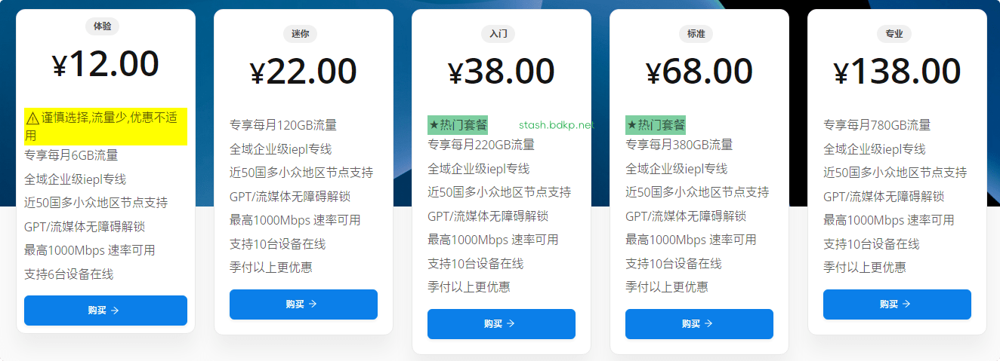

# 万城官网 万城专线官网最新入口地址 + 最新优惠码

最新地址：[wc-yz.com](https://port01.wc-yz.com/#/register?code=QVGTq85j)

> 万城网络专线机场跑路了吗？暂时没有。不过机场总会有跑路风险，为尽可能减少损失，选购套餐可按月支付。
> 另外没有啥绝对好坏，一线机场也会炸，小机场也可能岁月静好。

## 万城网络介绍

万城网络，一家运营在温哥华的IEPL全专线高端机。ChatGPT，TikTok，Netflix、Hulu、HBO、TVB、Happyon、AbemaTV 等流媒体稳定解锁。

万城专线节点覆盖30多个国家和地区，包括：香港、台湾、美国、日本、新加坡、马来西亚、菲律宾、韩国、印度、澳大利亚、以色列、加拿大、墨西哥、阿根廷、巴西、智利、英国、法国、德国、西班牙、瑞典、意大利、荷兰、波兰、南非、土耳其、新西兰、泰国等地区。

## 万城网络优惠码

专属85折万城专线优惠码: [9527](https://xuv.cc/out/wanc)

8折优惠码： [51vcity80](https://xuv.cc/out/wanc)（适用：半年付及以下，流量包适用）

9折优惠码：[51vcity90](https://xuv.cc/out/wanc)（适用：年付及以上，流量包不算年付）

## 万城网络价格

|名称|迷你|入门|标准|专业|独享|
|----|----|----|----|----|----|
|月付|￥12|￥22|￥38|￥68|￥138|
|季付|￥34|￥62|￥110|￥190|￥400|
|半年付|￥66|￥120|￥210|￥360|￥780|
|年付|￥128|￥190|￥340|￥590|￥1280|

**一次性付费**

计量迷你包（一年使用期）80GB ¥68

计量入门包（一年使用期）260GB ¥126

计量标准包（不限使用期）580GB ¥388

计量独享包（不限使用期）1280GB ¥788

